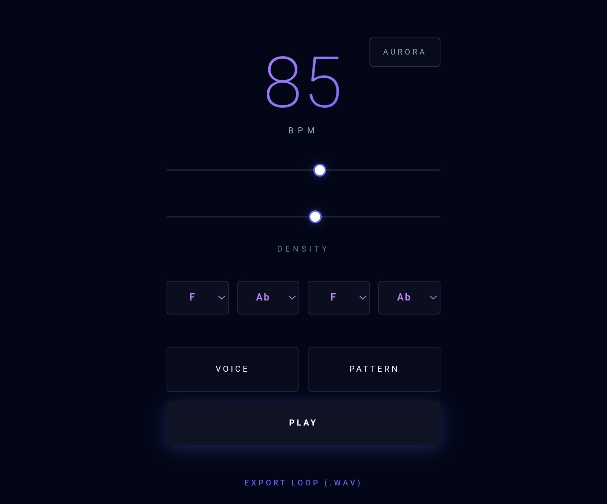

# Steppe

A minimal, browser-based bass arpeggiator that generates infinitely varied, human-feeling bass lines.

## What It Does

Steppe creates evolving bass patterns with musical intelligence. Every time you hit **Pattern**, it generates a new bass line with:

- **Real chord progressions** — not random notes
- **Groove personalities** — driving, bouncy, hypnotic, broken, minimal
- **Human imperfections** — timing drift, velocity variation, pitch wobble
- **8 voice presets** — from clean sine waves to heavy distortion

Perfect for producers needing bass inspiration, live performers, or anyone who wants endless generative bass loops.

---

## Getting Started

### Quick Start

1. Download `steppe.html`
2. Double-click to open in your browser
3. Click the splash screen to initialize audio
4. Press **Play**

That's it. No installation, no server, no dependencies to install.

### Requirements

- Any modern web browser (Chrome, Firefox, Safari, Edge)
- Internet connection on first load (Tone.js library caches after)

---

## How to Use

### Basic Controls

**Tempo Slider** — Set BPM (40-120)  
**Density Slider** — Control how many notes play (sparse to dense)  
**Voice Button** — Cycle through 8 synth voices  
**Pattern Button** — Generate a new bass line  
**Play/Stop** — Start/stop the sequence  

### Key Selectors

The 4 dropdowns represent the chord for each bar of your 4-bar loop. When you hit **Pattern**, these are automatically set to a musical progression, but you can manually override them.

### Export

Click **Export Loop (.wav)** to capture exactly one 4-bar loop as an audio file. The pattern will play through once and automatically stop recording.

---

## Musical Features

### Intelligent Pattern Generation

Steppe doesn't just randomize notes. Every pattern has:

- **Scale-aware melodies** — Minor, Phrygian, Dorian, Minor Pentatonic
- **Chord progressions** — Classic sequences like i-VI-III-VII, i-iv-v-i
- **Phrase structure** — 8-bar phrases with build/release dynamics
- **Melodic contour** — Notes move with direction, not random jumps

### Groove Templates

Each generation picks a rhythmic personality:

- **Driving** — Four-on-floor, relentless energy
- **Bouncy** — Syncopated, danceable
- **Hypnotic** — Minimal downbeats, off-beat emphasis
- **Broken** — Sparse, glitchy textures
- **Minimal** — Spacious, meditative

### Human Touch

Every note has subtle imperfections:

- **Timing drift** — ±15ms humanization
- **Velocity variation** — Simulates inconsistent finger pressure
- **Pitch wobble** — Analog-style VCO instability (±30 cents)
- **Articulation variety** — Staccato to sustained notes

---

## Voice Presets

1. **Pure** — Clean sine wave, warm sub bass
2. **Thick** — Rounded sine with light saturation
3. **Wooden** — Triangle wave, hollow character
4. **Solid** — Triangle with more drive, focused
5. **Tube** — Square wave, vintage warmth
6. **Grime** — Heavy square wave, aggressive
7. **Fuzz** — Sawtooth with distortion
8. **Heavy** — Maximum saturation, industrial

---

## Tips & Tricks

### Finding the Right Vibe

1. Start at **60-70 density** for a full pattern
2. Hit **Pattern** until you find a groove you like
3. Adjust **density** to taste (sparse = minimal, dense = busy)
4. Cycle **voices** to match your track's energy
5. Tweak individual **key selectors** for chord variations

### Performance Mode

- Set a slow tempo (40-60 BPM) and high density for ambient drones
- Fast tempo (100-120 BPM) + minimal groove = techno stabs
- Leave it running — patterns never repeat exactly the same

### Export Workflow

1. Generate patterns until you find one you love
2. Lock in your tempo and density
3. Click **Export Loop** (auto-stops after 4 bars)
4. Import the .wav into your DAW
5. Time-stretch, pitch-shift, resample as needed

---

## Technical Details

### Built With

- **Tone.js** — Professional audio synthesis and scheduling
- **Tailwind CSS** — Minimal UI styling
- **Web Audio API** — Low-level audio processing

### Audio Architecture

- Dual oscillator design (main + sub)
- Filter envelope modulation with velocity sensitivity
- Waveshaper distortion with 4x oversampling
- Compression + limiting on master bus
- Sample-accurate scheduling (no timing jitter)

### Browser Compatibility

Tested on:
- Chrome/Edge 90+
- Firefox 88+
- Safari 14+

---

## FAQ

**Q: Why does the first note sometimes sound different?**  
A: Audio context needs user interaction to start. Click the splash screen first.

**Q: Can I use this offline?**  
A: After first load, Tone.js is cached. You'll need internet once, then it works offline.

**Q: The patterns sound too random. How do I get more structure?**  
A: Lower the density slider. Sparse patterns reveal the underlying groove better.

**Q: Can I customize the voices?**  
A: Yes! Edit the `voices` array in the code. Each voice has oscillator type, filter settings, envelope params, and distortion amount.

**Q: Is this royalty-free?**  
A: Yes. All generated audio is yours to use commercially. MIT license.

---

## Roadmap

Potential future features:
- Swing/shuffle control
- MIDI export
- Custom scale input
- Reverb/delay sends
- Pattern lock (prevent regeneration)

---

## Contributing

Found a bug? Have an idea? Open an issue or submit a pull request.

---

## License

MIT License — use it, modify it, sell music made with it.

---

## Credits

Created for musicians who need bass lines that feel alive.

Built with Tone.js by Yotam Mann.

---

**Steppe** — Minimal tool. Maximum groove.
